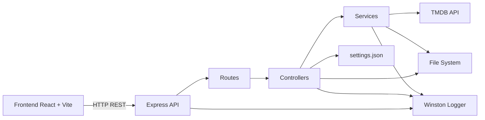
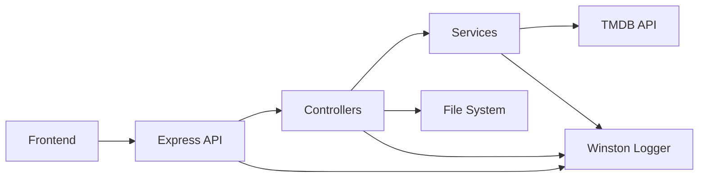
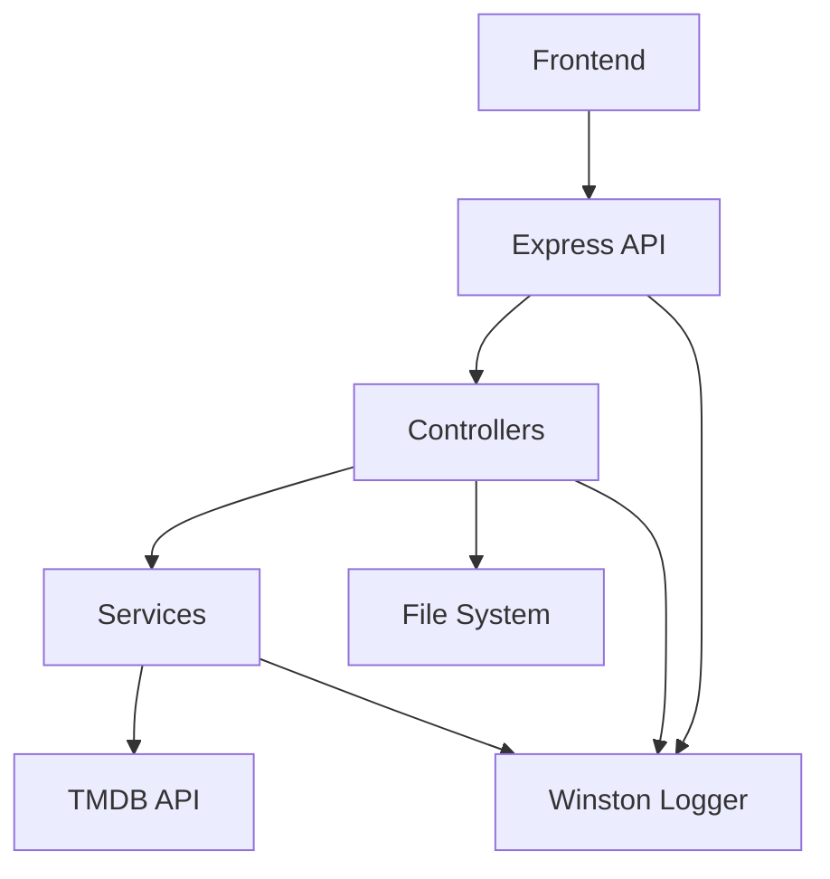
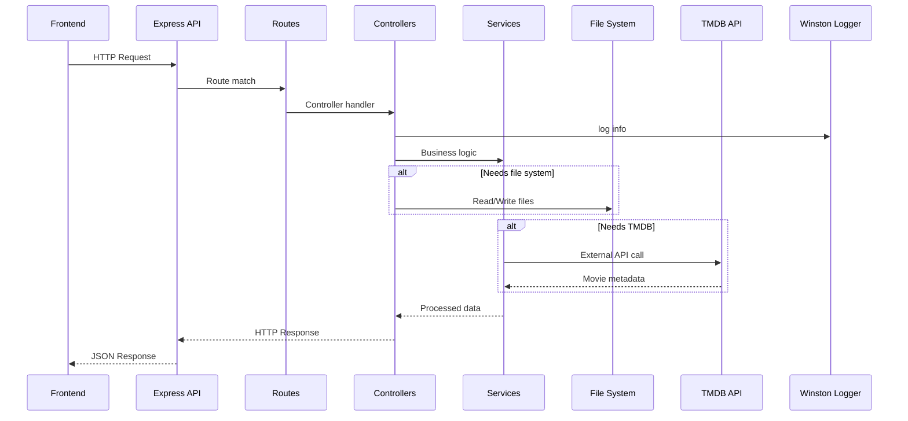

# 🎬 Videoteca 3 Server — REST API

Backend para una aplicación de videoteca local, desarrollado con Node.js y Express.  
Permite indexar carpetas del sistema, explorar archivos, obtener metadata desde TMDB, reproducir videos localmente y gestionar posters.

Incluye logging profesional con Winston, watcher de carpetas y arquitectura modular.

---

## 🚀 Features

- Indexación automática de carpetas de películas.  
- Explorador de sistema de archivos.  
- Biblioteca de películas indexadas.  
- Integración con TMDB (búsqueda y detalles).  
- Reproducción local de videos.  
- Corrección manual de posters (fix match).  
- Health check del servidor.  
- Watcher para detectar cambios en carpetas.  
- Logging centralizado con Winston.  

---

## 🧰 Stack Tecnológico

- Node.js  
- Express  
- JavaScript (ES Modules)  
- dotenv  
- Winston (logging)  
- The Movie Database (TMDB API)  
- Postman (testing)  

---

## 🏗️ Arquitectura

```bash
src/
├── app.js # Configuración Express
├── routes/
│ ├── api.routes.js # Rutas principales API
│ └── explorer.routes.js
├── controllers/ # Lógica de negocio
├── services/ # Indexer, watcher, TMDB, etc
├── config/
│ └── logger.js # Winston logger
└── data/
└── settings.json # Configuración persistida
```

server.js:
- Arranca Express.
- Ejecuta indexación inicial.
- Inicia watcher de carpetas.

---

## ⚙️ Instalación

```bash
git clone https://github.com/RDMartucci/videoteca3Server.git
cd videoteca3Server
npm install
```

#### Crear archivo .env:
```bash
PORT=5000
TMDB_TOKEN=TU_TOKEN_DE_TMDB
```
---

#### ▶️ Ejecución
```bash
npm start
```

#### Servidor por defecto:
```bash
http://localhost:5000
```

#### 📡 Base URL
```bash
http://localhost:5000/api
```

## 📚 Endpoints Principales
###  - Health Check

GET /api/health

###  - Configuración

GET /api/settings
POST /api/settings

###  - Biblioteca

GET /api/browse
POST /api/scan

###  - Explorador de Carpetas

POST /api/explorer/browse

###  - Reproductor

POST /api/play

###  - TMDB

GET /api/search-tmdb
GET /api/movie-details

###  - Fix Match (poster manual)

POST /api/fix-match

---

## 🪵 Logging (Winston)

Logger centralizado con:

- Timestamp automático.

- Colores en consola.

- Niveles: info, warn, error.

#### Ejemplo:

```bash
logger.info("Servidor iniciado");
logger.warn("No hay rutas configuradas");
logger.error("Error crítico", error);
```

---

## 🏛️ Architecture Diagram


#### 1️⃣ Diagrama Simplificado (Recomendado para README)

👉 Muestra la arquitectura general sin tanto detalle.



#### 2️⃣ Diagrama Vertical (Más claro en mobile)

👉 Ideal si el README se ve mucho en mobile.



#### 3️⃣ Request Lifecycle (Flujo de una Request)

👉 Súper pro para explicar cómo viaja una request.




---

## 📌 Portfolio Highlights

✔️ Integración real con filesystem.

✔️ Watcher en tiempo real.

✔️ Integración con API externa (TMDB).

✔️ Observabilidad con Winston.

✔️ Arquitectura modular (routes/controllers/services).

---

## 📄 Documentación

✔️POSTMAN_GUIA.md

✔️swagger.yaml (OpenAPI 3.0).


